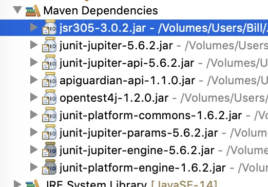

Class for monitoring multiple thread pools. For each, a bar graph will display number of threads,
queued tasks, and active tasks. Below a title is a count of total tasks submitted and completed.
Threshold lines are drawn at specified percentages showing yellow and red for warning and alert
when the count is high.

<b>Example</b><pre>
	final Font intialFont = new Font(FontUtils.COURIER, Font.BOLD, 24);
	final FontChooserDialog dialog =  new FontChooserDialog(null, "Font", intialFont).showDialog();
	Font newFont = dialog.getSelectedFont();
</pre>
<b>Build Requirements</b>
<pre>
	Java 11

	See pom.xml:
		Main code
			com.google.code.findbugs  jsr305 // javax.annotations
		Testing only
			org.junit.jupiter  junit-jupiter // JUnit 5

		Selected files required for non-test source.

		

</pre>
<b>Screenshot</b> 

