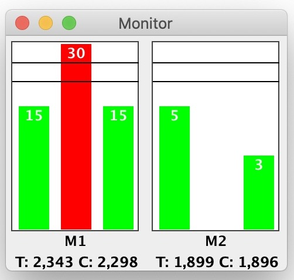

Dialog for selecting a Font (name, style, size). Lists font family, associated fonts, styles, and
sizes. Sizes maybe selected with a list, entering size in a field, or using a slider. Setting a
font will update all sliders and sample text.

<b>Example</b><pre>
	final Font intialFont = new Font(FontUtils.COURIER, Font.BOLD, 24);
	final FontChooserDialog dialog =  new FontChooserDialog(null, "Font", intialFont).showDialog();
	Font newFont = dialog.getSelectedFont();
</pre>
<b>Build Requirements</b>
<pre>
	Java 11

	See pom.xml:
		Main code
			com.google.code.findbugs  jsr305 // javax.annotations
		Testing only
			org.junit.jupiter  junit-jupiter // JUnit 5
</pre>
<b>Screenshot</b>

